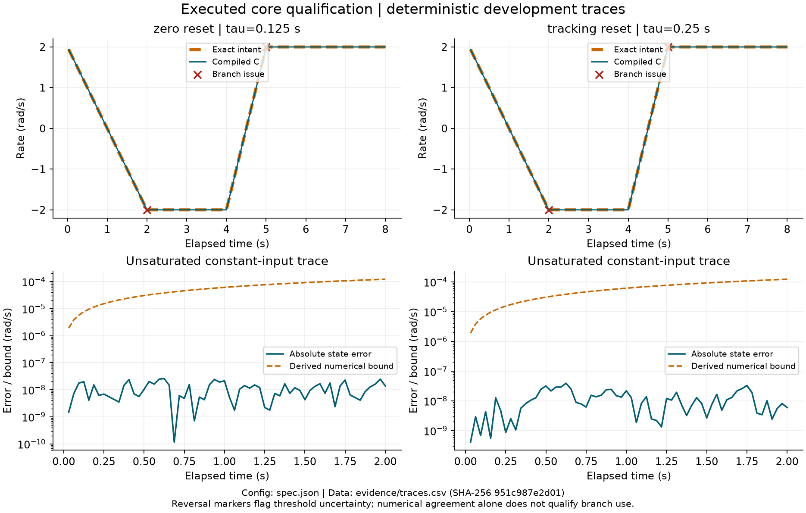

# Control code verification (local staging)

Compiled CasADi C and the binary32 reference agree on the frozen development
traces for the stateful angular-rate filter. The exact-rational intent checks
pass within the derived numerical bounds. Branch-near cases remain requirement
issues, so integration is unqualified. Counts, errors, build identity and case
locations have one result home: [evidence/results.json](evidence/results.json).

The adopted question asks which defects remain after a costed B2B baseline at
numerical, stateful and integration boundaries, and which additional checks
reduce them. This local result starts that work. The public successor name is
pending; this directory has local git and no remote.

[Specification and bounds](NUMERICS.md) · [Roadmap](ROADMAP.md) ·
[Frozen registration](registration.json) · [Parameters and units](spec.json)

## Reproduce

Use Python with the pinned [dependencies](requirements.txt) and Clang on the
recorded platform. From this directory:

```sh
python3 -m venv .venv
.venv/bin/python -m pip install -r requirements.txt
.venv/bin/python generate.py
.venv/bin/python qualify.py
```

`generate.py` is the generation factor. `qualify.py` compiles its artifacts,
checks compiler IR, executes independent analytic limits and compares isolated
steps and stateful sequences. The exact intent, binary32 reference and C all
consume the same frozen inputs. The verification timer includes compilation
and checks; it is one execution cost, not a latency distribution or fair
comparison against another method. No LLM port campaign ran.

The runner writes the result and [trace table](evidence/traces.csv). Build
products and IR remain in ignored `build/`. Final cases remain in ignored
`withheld/`; only their hash is registered. They were frozen before the first
implementation commit and have not been loaded by the runner. Reproduction
needs only the public development traces. Time samples and repeated runs are
not independent generated ports or confirmatory evidence.

## Figure



The figure reads the trace CSV and the parameter register. Rate, time and error
axes carry units; lines show deterministic development output, with threshold
issues marked. The caption names the configuration and data hash. Regenerate
with `python3 plot.py` in an environment with Matplotlib. Exact values and all
cases remain in the linked CSV; the plotted subset is not an extra experiment.

## Scope and provenance

This is the owner's authorized software pivot from
`500ft/uav-failsafe-composition`, following the v2 plan and objections review.
The old project's PR #50, typed parameter transport and SITL harness are useful
future integration sources. No harness was copied before an integration need.
Study A remains unfinished and paused in the original repository. Existing
failsafe results do not qualify this module.

The local filter boundary includes explicit state, reset and dt. A second
reviewer and branch requirements remain pending before a reviewed wrapper.
PX4 replay additionally needs a pinned build, every consumed topic at required
rate, timestamp and zero-stamp semantics, initialized state, controlled
publishers and a known-good repeat. No replay, SITL integration, hardware
measurement, release or deployment-readiness claim is made here.
